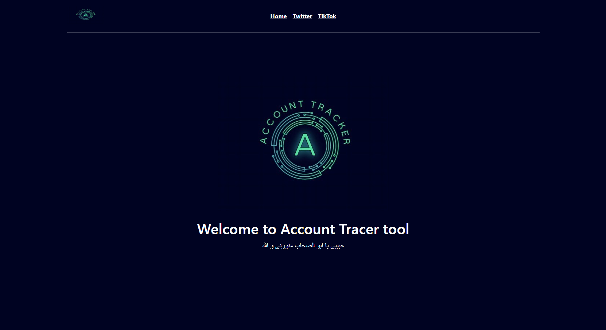
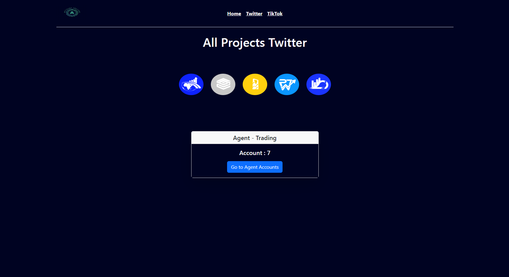
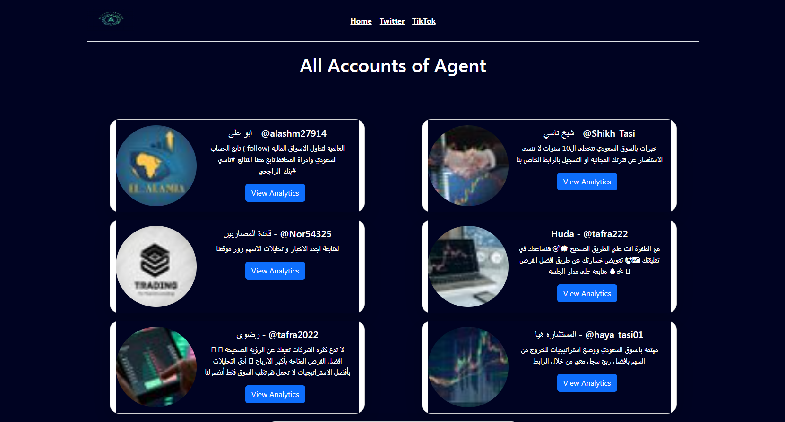
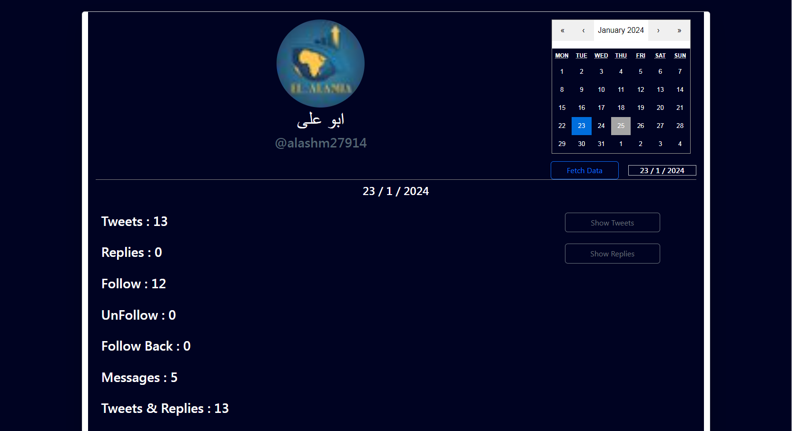
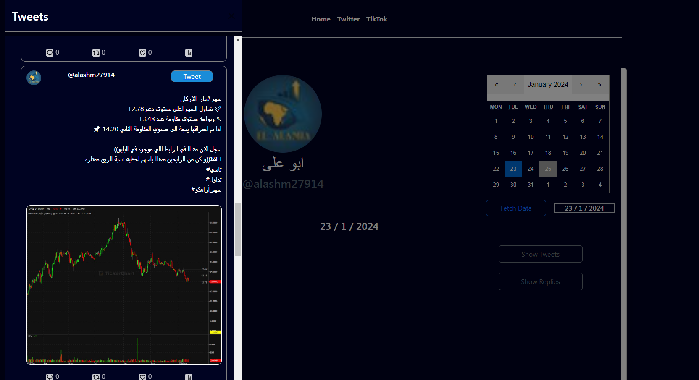

# Account Tracker

## Overview

Account Tracker is a full-stack project that allows users to add Twitter accounts and track their actions, such as tweets, replies, messages, follows, unfollows, and follow-backs. The project is built using React for the frontend, Django for the backend, and relies on two main periodic tasks.

### Features

- Add Twitter accounts to track their activities.
- Periodic tasks to read account tweets, replies, opened chats, follow, unfollow, and follow-back.
- Alert manager in Telegram bot to notify if the account's username or password is changed.
- Utilizes unofficial Twitter API for reading actions using the request library.
- Selenium web browser is employed for making a new login when adding a new account to fetch cookies and tokens.
- Can handle all crud operations and add , update , delete .  project or agent or account from django admin panel for
    - see [setup](#setup) steps  
    - create super user
        ```bash
        python manage.py createsuperuser
        ```
    - got to /admin and login 
    - Congratulations now you can use site

## Tech Stack

- **Frontend:** React
- **Backend:** Django
- **Periodic Tasks:** Apscheduler
- **Twitter API:** Unofficial TwitterAPI with the request library
- **Web Automation:** Selenium
- **Alerts:** Telegram bot

### ScreenShots

- Home Page : 
    - Useless page but made for future updates
     

- Category Part (Projects):
    - that contains agents 
    - filter buttons for get only exact project
     

- Agents Page :
    - that contains agent all accounts 
    - name - screen name - description - profile image
     

- Analytics Page :
    - set date and click to fetck to get analytics in this date
     

- Tweets & Replies SideBar :
    - scrolling area that show tweets or reply
     

- TelegramBot :
    - that have some alerts for accounts
     

# Setup

### Prerequisites

Make sure you have the following installed:

- Python
- Django
- Node.js **required if you will develop frontend part**
- React **required if you will develop frontend part**
- Other project dependencies (`requirements.txt`)

### Installation

1. Clone the repository:

   ```bash
   git clone "https://github.com/HeshamMoawad/Account-Tracer.git"
   ```

2. Install backend dependencies:
    ```bash
    pip install -r Backend/requirements.txt
    ```
3. Set up the database:
    ```bash
    python manage.py migrate
    ```
4. Start the Django development server:
    ```bash
    python manage.py runserver
    ```
## Usage

1. Add Twitter accounts through the web interface.

2. Periodic tasks will automatically track account activities.

3. Receive alerts in the Telegram bot if any account credentials are changed.


## Contributors
- [Hesham Moawad](https://github.com/HeshamMoawad)

### License

This project is licensed under the MIT License.

Feel free to contribute and make improvements!
